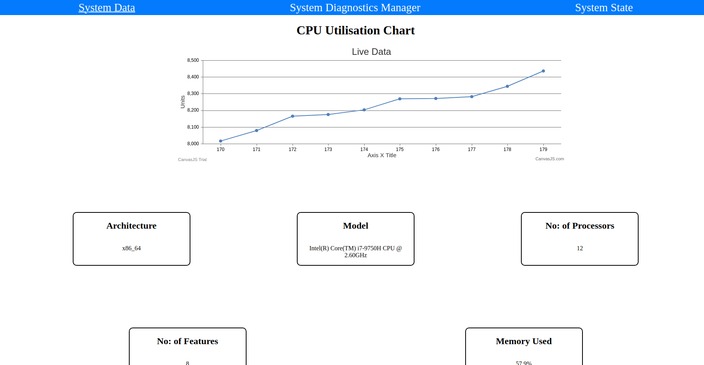

# Sample Diagnostics App for Chrome OS

## Milestones:
Milestone 1: Create a skeleton Telemetry Progressive Web App 
Milestone 2: Create a simple Chrome Extension
Milestone 3: Enable the PWA and Chrome Extension to communicate with each other

## Explaination
- I have used HTML, CSS, and JavaScript for the completing the project. 
- Details of the PWA is stored in the manifest.json which has the details about the extension
- For cache data, service-worker.js is used
- Systeminfo API is used to fetch details from system
- background.js script file in extension folder is used to fetch system information
- content.js script file in extension folder is used to add the details to the web page
- Message passing is used for the communication between the PWA and chrome extension

## Video Demo
The video contains the working demo of the PWA.
[YouTube Link](https://youtu.be/uzX7XGUo9As)

